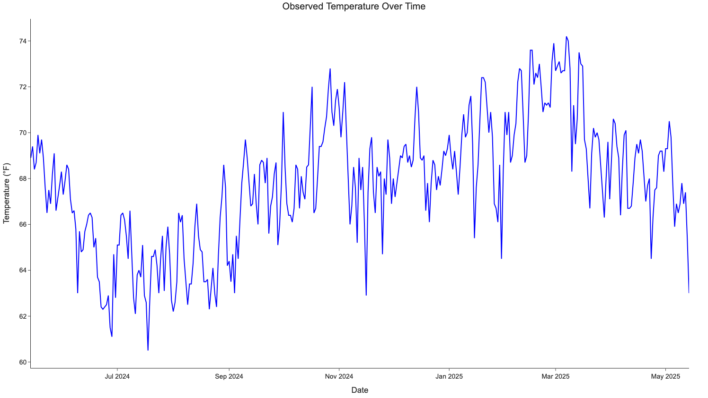
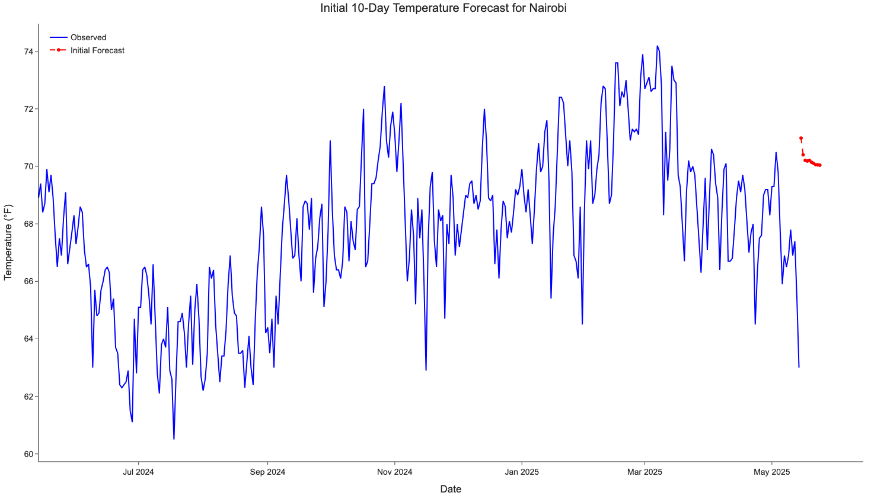
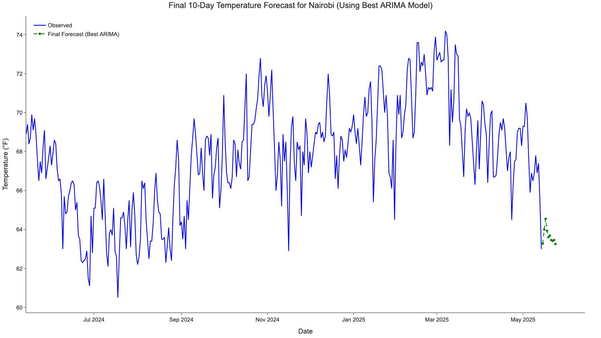

# Nairobi Temperature Forecast (ARIMA)

🔗 **[Read the Full Report on Medium](https://medium.com/@chiwai.kiriba/what-nairobis-weather-taught-me-about-time-series-forecasting-aaade4711b62)**  

This project uses an ARIMA model to forecast Nairobi's temperature for the next 10 days. Initially, a random ARIMA model is fitted and used to predict values. A grid search then follows to identify the best parameters for `p`, `d`, and `q`.

The dataset covers one year: **from May 14, 2024, to May 14, 2025**.

Forecasts are made for the next **10 days**, and temperature is measured in **Fahrenheit**.

## Steps to Run

1. Install the required dependencies:

```bash
pip install -r requirements.txt
````

2. Ensure `timeseries.csv` is in the **same directory** as the Python script.

3. Run the script:

```bash
python arima.py
```

## Visualizations

### Observed Temperature Over Time



### Initial 10-Day Forecast



### Final 10-Day Forecast (Best ARIMA Model)




## Notes

* Developed and tested using **PyCharm**.
* Use a **virtual environment** for best experience.

